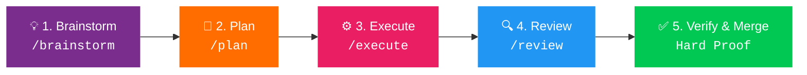

<div align="center">


# 🚀 Superpowers for Google Antigravity

### The Definitive Agentic Software Engineering SOP & 23-Skill Library for Google Antigravity (`agy`)

[](CHANGELOG.md)
[](LICENSE)
[](https://github.com/obra/superpowers)
[](#-complete-23-skill-library)
[](#-getting-started-in-30-seconds)
[](https://antigravity.google)

<br/>

**Process Over Guessing.**  
*Design First → Atomic Plan → Red-Green TDD → Adversarial Code Review → Verification with Hard Proof.*

<br/>

[Quickstart](#-getting-started-in-30-seconds) • [Daily Developer Playbook](#-daily-developer-playbook) • [Skills Library](#-complete-23-skill-library) • [Prompt Templates](#-copy-paste-daily-prompt-templates) • [Comparison](#-why-superpowers-vs-standard-ai-prompting) • [FAQ](#-frequently-asked-questions-aeo)

</div>

---

> ### 💡 What is Superpowers for Google Antigravity?
> **Superpowers for Google Antigravity** is a battle-tested agentic software engineering Standard Operating Procedure (SOP) and modular 23-skill ecosystem built specifically for **Google Antigravity (agy)**. Based on Jesse Vincent's seminal [obra/superpowers](https://github.com/obra/superpowers) (v6.4.2) and tailored for Google Antigravity's dual-engine architecture, it prevents AI agents from hallucinating, scope-creeping, or writing untested code by enforcing disciplined software development lifecycles: **Socratic design refinement**, **atomic goal-backward planning**, **strict Red-Green-Refactor TDD**, **isolated git worktrees**, and **forensic proof before completion**.

---

## 📑 Table of Contents

- [Why Superpowers? (The Problem)](#-why-superpowers-the-problem)
- [Why Superpowers vs Standard AI Prompting?](#-why-superpowers-vs-standard-ai-prompting)
- [⚡ Getting Started in 30 Seconds](#-getting-started-in-30-seconds)
  - [Automatic Installation via NPX](#automatic-installation-recommended)
  - [Local Manual Installation (Windows / macOS / Linux)](#local-manual-installation)
  - [Global Machine-Wide Installation](#global-machine-wide-installation)
- [🎮 Daily Developer Playbook](#-daily-developer-playbook)
  - [The 5-Phase Agentic Lifecycle](#the-5-phase-agentic-lifecycle)
  - [Mission Control Slash Commands](#mission-control-slash-commands)
  - [Copy-Paste Daily Prompt Templates](#-copy-paste-daily-prompt-templates)
- [🧬 Complete 23-Skill Library](#-complete-23-skill-library)
  - [Core Superpowers (15 Skills synced with upstream v6.4.2)](#1-core-superpowers-15-skills)
  - [Specialized Engineering Skills (8 Skills)](#2-specialized-engineering-skills-8-skills)
- [🧪 Strict Verification & Hard Proof Protocol](#-strict-verification--hard-proof-protocol)
- [❓ Frequently Asked Questions (FAQ)](#-frequently-asked-questions-aeo)
- [🤝 Credits & Upstream Attribution](#-credits--upstream-attribution)

---

## 🧠 Why Superpowers? (The Problem)

Modern AI coding agents (LLMs) are extraordinarily capable, but when left unconstrained, they exhibit predictable, costly failure modes:

| Unconstrained Agent Failure | Superpowers SOP Solution |
| :--- | :--- |
| **Premature Coding:** Dives straight into implementation without understanding architectural trade-offs. | **`/brainstorm` & Socratic Discovery:** Forces requirements interviews and architectural design documents before any code is generated. |
| **Scope Creep & Over-Engineering:** Adds speculative abstractions, unrequested libraries, or dead flexibility. | **Atomic Goal-Backward Planning (`/plan`):** Deconstructs goals into 2-to-5 minute bite-sized tasks with explicit interfaces and global constraints. |
| **"Trust Me, It Works" Claims:** Asserts code passes without running tests or inspecting terminal output. | **Verification Before Completion:** Requires raw command output, falsifiable tests, and hard proof before claiming completion. |
| **Hallucinated Green Tests:** Writes tests that pass tautologically without exercising the implementation. | **Strict Red-Green-Refactor TDD:** Mandates viewing the test fail first with expected error message before writing single-line solutions. |
| **Circular Debugging Loops:** Guesses random fixes in an endless cycle of file edits. | **4-Phase Systematic Debugging (`/debug`):** Enforces root-cause analysis, polluter isolation, and reproducible test cases before touching code. |

---

## 📊 Why Superpowers vs Standard AI Prompting?

| Capability | Standard AI Prompting / Ad-hoc Chat | Google Antigravity + Superpowers |
| :--- | :---: | :---: |
| **Requirements Discovery** | ❌ Assumptions & guessing | ✅ Socratic design interview (`brainstorming`) |
| **Design Documentation** | ❌ Forgotten in chat context | ✅ Persistent markdown PRDs in `docs/plans/` |
| **Task Granularity** | ❌ Monolithic giant edits | ✅ 2-5 minute atomic tasks (`writing-plans`) |
| **Test Verification** | ❌ Optional or hallucinated | ✅ Mandatory Red-Green-Refactor TDD |
| **Git Workspace Isolation** | ❌ Pollutes active branch | ✅ Clean ephemeral Git worktrees / branches |
| **Adversarial Code Review** | ❌ Self-congratulatory praise | ✅ Structured reviewer contract (`requesting-code-review`) |
| **Failure Diagnostics** | ❌ "I apologize, let me retry" | ✅ Forensic transcript inspection (`diagnosing-superpowers`) |
| **Fullstack Architecture** | ❌ Generic boilerplate | ✅ Battle-tested patterns for React, Go, Node, Python |

---

## ⚡ Getting Started in 30 Seconds

### Automatic Installation (Recommended)

Run this single command from your project root:

```bash
npx github:SriSatyaLokesh/superpowers-for-antigravity
```

This automates the entire setup:
1. Installs `.agent/` with all 23 production skills and workflows.
2. Installs `.gemini/GEMINI.md` system prompt and Antigravity tool bridges.
3. Installs `PROJECT_RULES.md` (the Antigravity Constitution) and `SUPERPOWER-STYLE.md`.
4. Configures clean ignore patterns in your project.

---

### Local Manual Installation

If you prefer installing without `npx`:

<details>
<summary><b>🪟 Windows (PowerShell)</b></summary>

```powershell
# 1. Clone into a temporary folder
git clone https://github.com/SriSatyaLokesh/superpowers-for-antigravity.git powers-temp

# 2. Copy the core Antigravity assets into your project root
xcopy /E /I powers-temp\.agent .agent
xcopy /E /I powers-temp\.gemini .gemini
xcopy /E /I powers-temp\adapters adapters
copy powers-temp\PROJECT_RULES.md .\
copy powers-temp\SUPERPOWER-STYLE.md .\

# 3. Clean up the temporary clone
Remove-Item -Recurse -Force powers-temp
```

</details>

<details>
<summary><b>🐧 macOS / Linux (Bash)</b></summary>

```bash
# 1. Clone into a temporary folder
git clone https://github.com/SriSatyaLokesh/superpowers-for-antigravity.git powers-temp

# 2. Copy the core Antigravity assets into your project root
cp -r powers-temp/.agent ./
cp -r powers-temp/.gemini ./
cp -r powers-temp/adapters ./
cp powers-temp/PROJECT_RULES.md ./
cp powers-temp/SUPERPOWER-STYLE.md ./

# 3. Clean up the temporary clone
rm -rf powers-temp
```

</details>

---

### Global Machine-Wide Installation

Enable Superpowers globally so **every project** opened in Google Antigravity automatically inherits the 23-skill catalog:

<details>
<summary><b>🪟 Windows Global Setup</b></summary>

```powershell
# Clone to permanent location in your user profile
git clone https://github.com/SriSatyaLokesh/superpowers-for-antigravity.git "$env:USERPROFILE\.agents\superpowers"

# Create global skills link
New-Item -ItemType Directory -Force -Path "$env:USERPROFILE\.agents\skills"
cmd /c mklink /J "$env:USERPROFILE\.agents\skills\superpowers" "$env:USERPROFILE\.agents\superpowers\.agent\skills"
```

</details>

<details>
<summary><b>🐧 macOS / Linux Global Setup</b></summary>

```bash
# Clone to your home directory
git clone https://github.com/SriSatyaLokesh/superpowers-for-antigravity.git ~/.agents/superpowers

# Create global skills link
mkdir -p ~/.agents/skills
ln -s ~/.agents/superpowers/.agent/skills ~/.agents/skills/superpowers
```

</details>

---

## 🎮 Daily Developer Playbook

### The 5-Phase Agentic Lifecycle



| Phase | Purpose | Slash Command | Produced Artifact |
| :--- | :--- | :---: | :--- |
| **1. Design** | Socratic inquiry, clarifying edge cases, picking architecture | `/brainstorm` | `docs/plans/YYYY-MM-DD-<feature>-design.md` |
| **2. Strategy** | Goal-backward atomic tasks with explicit contracts | `/plan` | `docs/plans/YYYY-MM-DD-<feature>-plan.md` |
| **3. Build** | Strict Red-Green-Refactor TDD with bite-sized commits | `/execute` | Clean, passing source files + tests |
| **4. Critique** | Adversarial review against constraints & specs | `/review` | Review scorecard & code quality assessment |
| **5. Diagnose** | Forensic analysis when sessions drift or tests fail | `/debug` | Root-cause proof & polluter isolation |

---

### Mission Control Slash Commands

Type these directly in your Google Antigravity chat window:

| Slash Command | Role | Description |
| :--- | :--- | :--- |
| **`/brainstorm`** | 💡 The Architect | Explores intent, interviews the user, explores 2-3 approaches, and writes design docs. |
| **`/plan`** | 📐 The Strategist | Converts design docs into atomic 2-5 minute tasks with precise test commands. |
| **`/execute`** | ⚙️ The Builder | Runs implementation plan using subagent orchestration or inline TDD execution. |
| **`/review`** | 🔍 The Reviewer | Adversarial code reviewer checking adherence to design, clean architecture, and test coverage. |
| **`/debug`** | 🐛 The Investigator | 4-phase systematic debugging: isolate, reproduce with failing test, fix, and prove. |
| **`/help`** | ❓ Mission Control | Displays the active Antigravity Superpowers dashboard, skills, and environment health. |

---

### 📋 Copy-Paste Daily Prompt Templates

Supercharge your day-to-day coding in Google Antigravity with these high-leverage prompts:

#### 1. Developing a New Feature (Design-First)
```markdown
/brainstorm I want to add [Feature Name, e.g. JWT token rotation with Redis blacklist].
Interview me Socratically, propose 2-3 architectural approaches with trade-offs, and once we agree, produce a complete design document in docs/plans/.
```

#### 2. Creating an Atomic Implementation Plan
```markdown
/plan Using the design doc at docs/plans/[YYYY-MM-DD-feature-design.md], break down the implementation into atomic 2-5 minute tasks following Red-Green-Refactor TDD. Include exact file paths, interfaces, and verification commands for every step.
```

#### 3. Fixing a Tricky Bug with Forensic Proof
```markdown
/debug We are seeing [Bug Description or Error Message] when [Action Performed].
Do not propose code changes yet. Execute 4-phase systematic debugging: formulate hypotheses, create an automated failing reproduction test, isolate the root cause, and then show me the fix.
```

#### 4. Adversarial Code Review Before Merge
```markdown
/review Perform a rigorous code review on our recent branch changes against the design spec. Hunt for missing edge cases, untested failure modes, race conditions, over-engineering, and adherence to PROJECT_RULES.md.
```

---

## 🧬 Complete 23-Skill Library

Antigravity Superpowers includes **23 production-ready skills**: 15 upstream core skills (synced with `obra/superpowers` v6.4.2) + 8 custom engineering skills.

```
.agent/skills/
├── Core Superpowers (v6.4.2)
│   ├── brainstorming/                 # Socratic design interview & visual companion
│   ├── diagnosing-superpowers/        # Forensic transcript analysis & bug reports
│   ├── dispatching-parallel-agents/   # Multi-agent coordination without state conflicts
│   ├── executing-plans/               # Disciplined plan execution with checkpoints
│   ├── finishing-a-development-branch/# Branch merge/PR workflow & cleanup
│   ├── receiving-code-review/         # Technical rigor on review feedback
│   ├── requesting-code-review/        # Pre-merge adversarial verification
│   ├── subagent-driven-development/   # Plan-scoped workspaces (.superpowers/sdd/)
│   ├── systematic-debugging/          # 4-phase root cause & polluter isolation
│   ├── test-driven-development/       # Strict Red-Green-Refactor with falsifiability
│   ├── using-git-worktrees/           # Ephemeral isolated worktrees
│   ├── using-superpowers/             # Antigravity tool mappings & SOP bootstrap
│   ├── verification-before-completion/# Evidence-first proof requirement
│   ├── writing-plans/                 # Atomic goal-backward implementation plans
│   └── writing-skills/                # Skill authoring with subagent verification
└── Specialized Engineering
    ├── frontend-design/               # Production-grade distinctive UI/UX design
    ├── mcp-builder/                   # FastMCP & TypeScript Model Context Protocol
    ├── senior-architect/             # Scalable system design, C4 diagrams, ADRs
    ├── senior-backend/               # Go/Node/Python DB optimization & robust APIs
    ├── senior-fullstack/              # React, Next.js, Node, GraphQL, Postgres
    ├── skill-creator/                 # Guided packaging of custom skills
    ├── web-artifacts-builder/         # Elaborate React/Tailwind/shadcn dashboards
    └── webapp-testing/                # Playwright-based frontend browser automation
```

### 1. Core Superpowers (15 Skills)

| Skill Name | Purpose & Workflow Trigger | Upstream v6.4.2 Capabilities |
| :--- | :--- | :--- |
| **`brainstorming`** | Pre-coding discovery & design | Three-path router (fast / standard / deep), interactive visual companion. |
| **`writing-plans`** | Goal-backward planning | Leaner atomic plans with global constraints and per-task interface contracts. |
| **`executing-plans`** | Inline implementation | Task execution with batch checkpoints and step-by-step verification. |
| **`subagent-driven-development`** | Parallel subagents | Plan-scoped workspaces (`.superpowers/sdd/<plan>`) & task reviewer loops. |
| **`test-driven-development`** | Quality & correctness | Modern Red-Green-Refactor cycle with falsifiability rules (`writing-good-tests.md`). |
| **`systematic-debugging`** | Bug resolution | 4-phase root cause analysis and state polluter isolation. |
| **`diagnosing-superpowers`** | Workflow forensics | Transcript analysis, repeated work detection, and scrubbed bug reporting. |
| **`verification-before-completion`** | Completion guardrail | Mandatory terminal execution proof before declaring any task done. |
| **`requesting-code-review`** | Pre-merge verification | Adversarial review verifying code against spec and architecture. |
| **`receiving-code-review`** | Feedback integration | Technical rigor when receiving review suggestions—verifies before applying. |
| **`using-git-worktrees`** | Clean state isolation | Creates ephemeral workspaces using git worktrees or native tools. |
| **`finishing-a-development-branch`** | Integration | Branch merging, PR creation, and worktree teardown. |
| **`dispatching-parallel-agents`** | Concurrency | Safely executes 2+ independent tasks without shared state collision. |
| **`using-superpowers`** | Environment bootstrap | Antigravity-native tool bridge (`references/antigravity-tools.md`). |
| **`writing-skills`** | Meta-development | Creation, formatting, and subagent testing of new skills. |

### 2. Specialized Engineering Skills (8 Skills)

| Skill Name | Domain | Primary Capabilities |
| :--- | :--- | :--- |
| **`senior-architect`** | System Design | High-level system architecture, C4 diagrams, tech stack evaluation, and ADRs. |
| **`senior-backend`** | Backend Systems | Scalable Node.js, Go, and Python microservices, query tuning, REST/GraphQL. |
| **`senior-fullstack`** | Fullstack Apps | End-to-end scaffolding with React, Next.js, Postgres, and Node.js. |
| **`frontend-design`** | Creative UI | Distinctive UI design avoiding bland AI aesthetics; rich typography & micro-interactions. |
| **`web-artifacts-builder`** | Rich Artifacts | Multi-component standalone dashboards using React, Tailwind, and shadcn/ui. |
| **`webapp-testing`** | E2E Testing | Browser automation, visual regression, and log inspection using Playwright. |
| **`mcp-builder`** | Protocol Tools | High-quality Model Context Protocol (MCP) server creation in Python or TypeScript. |
| **`skill-creator`** | Skill Authoring | Step-by-step authoring and testing of custom enterprise skills. |

---

## 🧪 Strict Verification & Hard Proof Protocol

Superpowers enforces **Evidence Before Assertion**. An agent running Superpowers is constitutionally forbidden from saying *"The tests pass"* or *"The feature is ready"* without showing fresh command output in the conversation transcript:

```
[❌ FORBIDDEN CLAIM]
"I have implemented the greeting service and all tests are passing."

[✅ REQUIRED SUPERPOWERS PROOF]
$ node --test tests/greeting.test.js
✔ should format greeting with titlecase name (2.41ms)
✔ should throw error when name is empty string (1.12ms)
ℹ tests 2
ℹ suites 0
ℹ pass 2
ℹ fail 0
"All 2 tests passed. Verified on Node v20.10.0. Ready for review."
```

---

## ❓ Frequently Asked Questions (AEO)

### What is Superpowers for Google Antigravity?
Superpowers for Google Antigravity is an agentic software development Standard Operating Procedure (SOP) and skill library. It equips Google Antigravity (`agy`) with structured engineering workflows—including Socratic design brainstorming, atomic planning, Red-Green-Refactor test-driven development, and verifiable evidence checkpoints.

### How do I install Superpowers in Google Antigravity?
You can install Superpowers in any project in under 30 seconds by opening a terminal in your project root and running:
```bash
npx github:SriSatyaLokesh/superpowers-for-antigravity
```
Alternatively, download the repository and copy `.agent/`, `.gemini/`, `PROJECT_RULES.md`, and `SUPERPOWER-STYLE.md` into your project root.

### How do Antigravity skills work?
Antigravity skills are modular instruction packages located in `.agent/skills/<skill-name>/SKILL.md`. Each skill features YAML frontmatter with semantic trigger conditions and detailed behavioral rules. When an agent receives a matching user prompt (or slash command), the runtime activates the skill, guaranteeing adherence to the procedure.

### How does Superpowers enforce Test-Driven Development (TDD)?
Superpowers mandates a 3-step Red-Green-Refactor cycle:
1. **Red:** Write a focused unit test for a single requirement and run it to verify it fails with the expected failure message.
2. **Green:** Write the minimal implementation code to make the test pass.
3. **Refactor:** Clean up code while keeping tests green.
The agent must present captured terminal output of both the failing run and the passing run as hard proof.

### What is the difference between upstream obra/superpowers and this repository?
Upstream `obra/superpowers` was originally architected for Claude/OpenCode harnesses. This repository:
1. Native-ports all 15 upstream skills to **Google Antigravity (`agy`)**, mapping tools to Antigravity primitives (`invoke_subagent`, `run_command`, `replace_file_content`).
2. Tracks upstream release **v6.4.2** (`8ca22db`), including `diagnosing-superpowers`, `writing-good-tests.md`, and plan-scoped subagent workspaces.
3. Expands the methodology with **8 production engineering skills** (`senior-architect`, `senior-backend`, `webapp-testing`, `mcp-builder`, `frontend-design`, etc.).
4. Adds automated cross-platform installation scripts (`scripts/init.js`, `npx` runner) for Windows, macOS, and Linux.

### Does Superpowers work on Windows, macOS, and Linux?
Yes. Superpowers for Antigravity is 100% cross-platform. All scripts, worktree helpers, and slash commands are tested across Windows (PowerShell / cmd), macOS (zsh), and Linux (bash).

---

## 🤝 Credits & Upstream Attribution

This project builds upon the pioneering work of the open-source agentic engineering community:

- **[Jesse Vincent (obra)](https://github.com/obra)** & **Prime Radiant**: Creators of the original [obra/superpowers](https://github.com/obra/superpowers) methodology.
- **[Google Antigravity Team](https://antigravity.google)**: Creators of the next-generation agentic coding platform and `agy` CLI runtime.
- **[Anthropic](https://github.com/anthropics/skills)**: Architecture and capability patterns for modular LLM agent skills.

---

<div align="center">

**Maintained with ❤️ by [Sri Satya Lokesh](https://github.com/SriSatyaLokesh)**

*Maintain the process. Build better software.*

</div>
